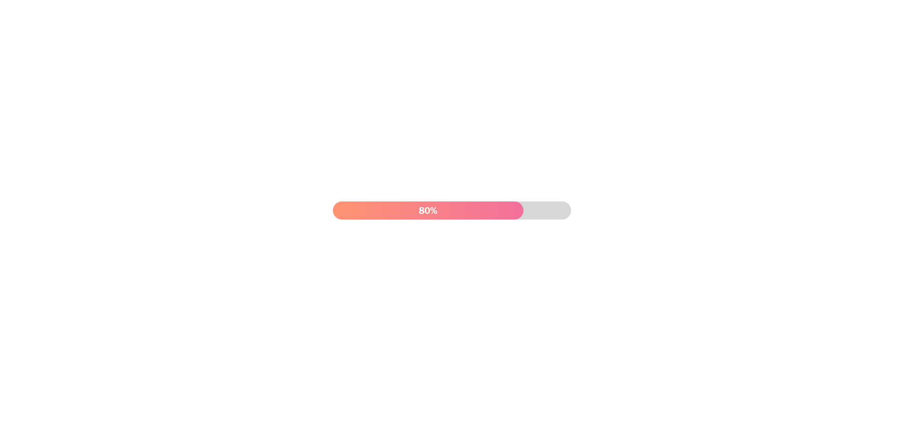
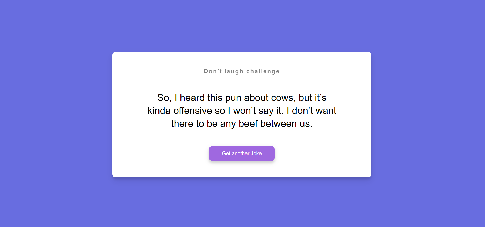
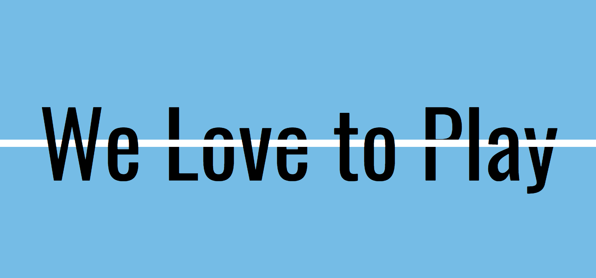
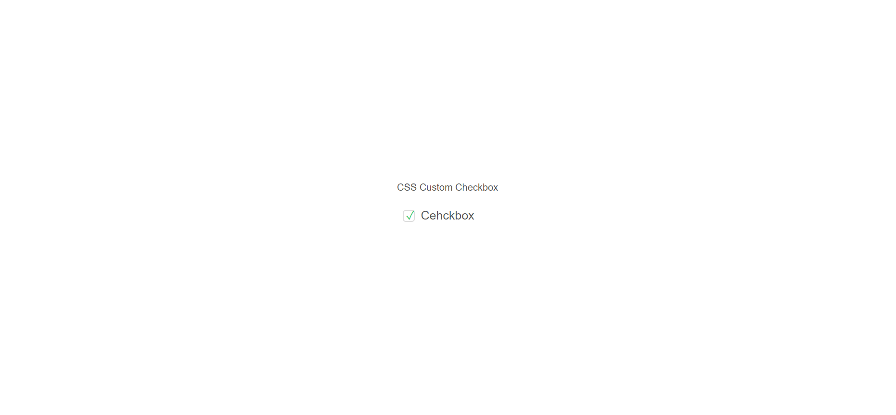

## 31 Days 31 Projects is a challenge following the design and sequence of Florin Pop.

https://www.youtube.com/playlist?list=PLgBH1CvjOA62ktHHwqSYBeq4jmGmUezNo

### 01 - Progress bar with css and js

### 02 - Jokes Gerator

### 03 - Image Password Strength Effect

### 04 - Line through effect

### 05 - Visual couter

### 06 - Custom checkbox

### 07 - Traffic lights simulator

### 08 - Image reflection

